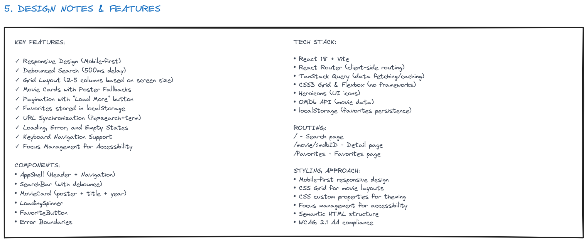
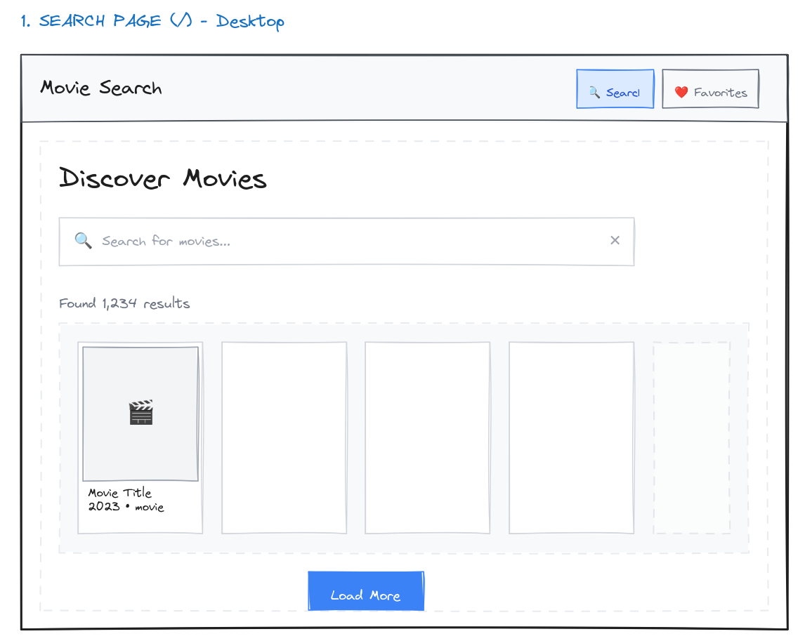
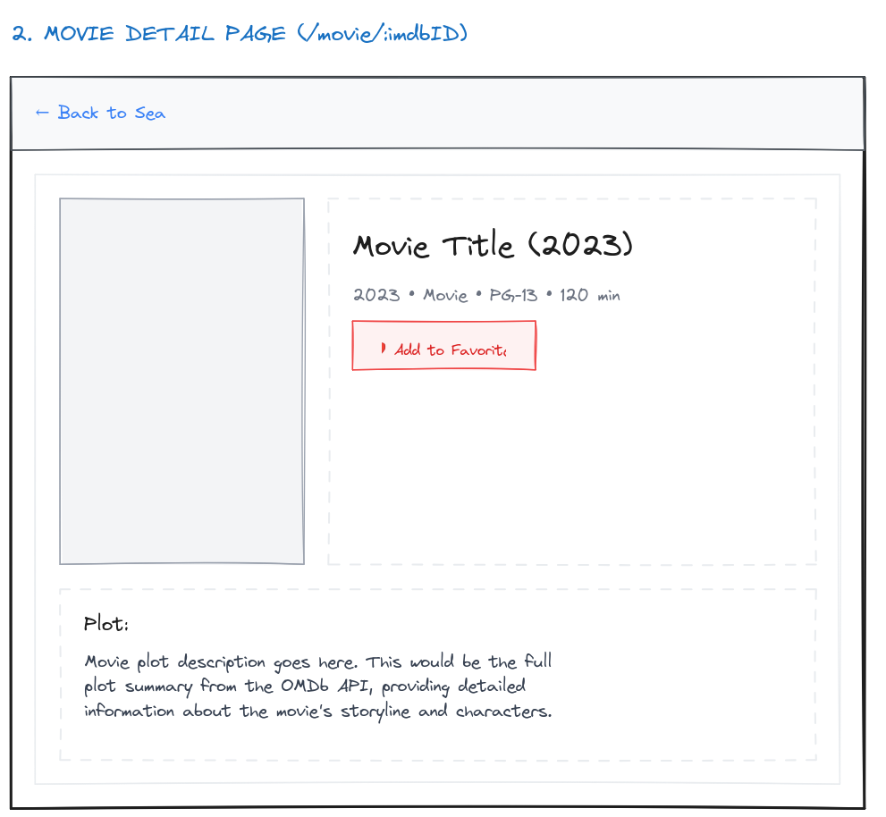
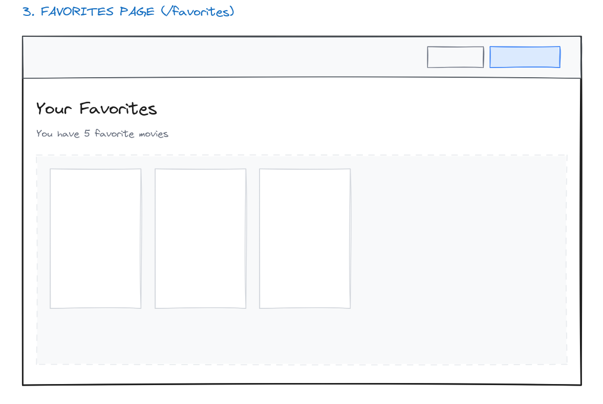
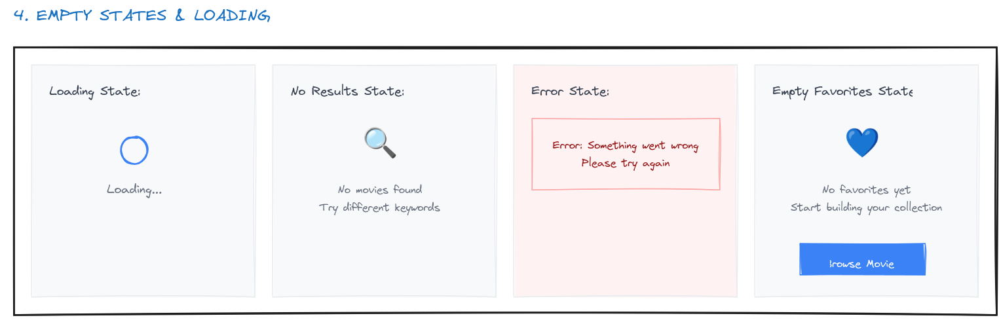

# 🎨 Movie Search App - Wireframes Overview

This document presents the complete wireframe sequence for the Movie Search App, showing the user interface design and flow across all main features and states.

## 📱 Design Overview

The wireframes demonstrate a strong foundation for application development. Each wireframe shows key UI components, user interactions, and different application states. it should mirror the final visual design closely as well as the [architecture diagram](./architecture-diagram.mmd).

### **Key Design Principles:**
- **Progressive Enhancement:** Enhanced features for larger screens
- **Responsive Grid:** Adaptive layout from 1-5 columns based on screen size
- **Consistent Navigation:** Persistent header with clear navigation patterns


## 🗺️ User Flow Sequence

### **Step 0: Application Shell & Navigation**


**What this shows:**
- **App Header:** Logo, navigation menu, responsive design
- **Main Layout:** Content area with proper spacing and typography
- **Navigation States:** Active/inactive menu items
- **Mobile Considerations:** Hamburger menu for smaller screens
- **Accessibility Features:** Focus indicators and skip links

**Key Components:**
- AppShell layout structure
- Header with logo and navigation
- Responsive breakpoint behavior
- Mobile navigation patterns


### **Step 1: Search Page - Initial State**


**What this shows:**
- **Search Interface:** Prominent search bar with icons
- **Empty State:** Welcome message and search prompt
- **Layout Structure:** Grid system ready for results
- **Call-to-Action:** Clear instructions for first-time users
- **Responsive Design:** How search adapts to different screen sizes

**Key Components:**
- SearchBar component with debounced input
- Empty state messaging and imagery
- Responsive grid layout foundation
- Loading state preparation


### **Step 2: Search Results - Populated Grid**


**What this shows:**
- **Movie Grid:** Responsive card layout (2-5 columns)
- **Movie Cards:** Poster, title, year, rating display
- **Hover States:** Interactive feedback for cards
- **Pagination:** "Load More" or infinite scroll patterns
- **Result Count:** Number of movies found
- **Responsive Behavior:** How grid adapts to screen width

**Key Components:**
- MovieCard component design
- Grid responsive breakpoints
- Loading states for additional results
- Search result management


### **Step 3: Movie Detail Page - Full Information**


**What this shows:**
- **Hero Section:** Large poster and key movie information
- **Detailed Information:** Plot, cast, director, ratings, runtime
- **Favorite Button:** Heart icon for saving/removing favorites
- **Navigation:** Back button and breadcrumb navigation
- **Responsive Layout:** How content reflows on different screens
- **Action Buttons:** Primary and secondary actions

**Key Components:**
- MovieDetailPage layout structure
- FavoriteButton component integration
- Information hierarchy and typography
- Navigation and user flow patterns


### **Step 4: Favorites Page - Saved Movies**


**What this shows:**
- **Favorites Grid:** Saved movies in familiar card layout
- **Page Header:** Title with favorites count
- **Empty State:** Message when no favorites saved
- **Management Actions:** Remove from favorites functionality
- **Consistent Layout:** Same grid system as search results
- **Navigation Context:** Clear indication of current page

**Key Components:**
- FavoritesPage layout and grid
- Empty state design for no favorites
- Favorite management interactions
- Consistent UI patterns across pages


## 🔧 Technical Implementation Notes

### **Responsive Breakpoints:**
```css
/* Mobile First Approach */
.movie-grid {
  display: grid;
  gap: 1rem;
  
  /* Mobile: 2 columns */
  grid-template-columns: repeat(2, 1fr);
  
  /* Tablet: 3 columns */
  @media (min-width: 768px) {
    grid-template-columns: repeat(3, 1fr);
  }
  
  /* Desktop: 4 columns */
  @media (min-width: 1024px) {
    grid-template-columns: repeat(4, 1fr);
  }
  
  /* Large Desktop: 5 columns */
  @media (min-width: 1200px) {
    grid-template-columns: repeat(5, 1fr);
  }
}
```

### **Component Hierarchy:**
```
App
├── Components
│   ├── Header (Logo + Navigation)
│   └── Main Content Area
│       ├── SearchPage
│       │   ├── SearchBar
│       │   └── MovieGrid
│       │       └── MovieCard[]
│       ├── MovieDetailPage
│       │   ├── MovieHero
│       │   ├── MovieInfo
│       │   └── FavoriteButton
│       └── FavoritesPage
│           ├── PageHeader
│           └── FavoritesGrid
│               └── MovieCard[]
```

### **State Management:**
- **Search State:** Query, results, loading, error
- **Favorites State:** Saved movies (localStorage)
- **Navigation State:** Current route, history
- **API State:** Cached responses (TanStack Query)

## 🎯 Design Decision Rationale

### **Why This Layout:**
1. **Mobile-First:** Majority of users browse on mobile devices
2. **Card-Based UI:** Familiar pattern for movie/media content
3. **Progressive Disclosure:** Show essential info, drill down for details
4. **Consistent Navigation:** Same header/nav across all pages
5. **Grid System:** Flexible, responsive, scalable layout

### **Accessibility Considerations:**
- **High Contrast:** Clear visual hierarchy and readable text
- **Focus Management:** Logical tab order and visible focus states
- **Screen Reader Support:** Proper ARIA labels and semantic markup
- **Touch Targets:** Minimum 44px touch targets for mobile
- **Keyboard Navigation:** All interactions accessible via keyboard

### **Performance Optimizations:**
- **Lazy Loading:** Images load as they come into viewport
- **Skeleton States:** Loading placeholders maintain layout
- **Infinite Scroll:** Load more content on demand
- **Image Optimization:** Responsive images with proper sizing

## 📐 Design Specifications

### **Typography Scale:**
- **Headings:** 2rem, 1.5rem, 1.25rem (responsive)
- **Body Text:** 1rem base size
- **Small Text:** 0.875rem (meta information)

### **Spacing System:**
- **Base Unit:** 0.25rem (4px)
- **Component Spacing:** 1rem, 1.5rem, 2rem
- **Section Spacing:** 2rem, 3rem, 4rem

### **Color Palette:**
- **Primary:** Movie theme colors (deep blues, accent golds)
- **Neutral:** Grays for text and backgrounds
- **Semantic:** Success (green), Error (red), Warning (yellow)
- **Interactive:** Hover and focus state colors

### **Component Sizes:**
- **Movie Cards:** 200px width (mobile) to 240px (desktop)
- **Header Height:** 64px consistent across breakpoints
- **Search Bar:** Full width mobile, max-width desktop
- **Buttons:** 44px minimum touch target

## 🚀 Implementation Roadmap

### **Milestone 1: Foundation** 
- Components and basic routing
- Responsive grid system
- Basic component structure

### **Milestone 2: Search Flow** ✅
- SearchBar with debouncing
- MovieCard component
- Search results grid
- API integration

### **Milestone 3: Detail & Favorites** ✅
- Movie detail page layout
- Favorites functionality
- localStorage integration
- Navigation flow

### **Milestone 4: Polish & Performance** ✅
- Loading states and animations
- Error handling UI
- Accessibility improvements
- Performance optimizations

## 💡 Usage Instructions

**For Developers:**
1. **Start with Step-0:** Understand the overall layout structure
2. **Follow the sequence:** Each step builds upon the previous
3. **Note responsive behavior:** How layouts adapt across breakpoints
4. **Implement progressively:** Build basic functionality first, enhance later

**For Designers:**
1. **Visual Reference:** Use these as a baseline for visual design
2. **Component Library:** Extract reusable components from wireframes
3. **User Testing:** Validate flow and interactions with users
4. **Iteration:** Update wireframes based on development feedback

**For Stakeholders:**
1. **User Journey:** Follow the complete user experience
2. **Feature Overview:** See all planned functionality
3. **Responsive Behavior:** Understand mobile and desktop experiences
4. **Success Metrics:** Identify key interaction points

*These wireframes serve as the visual blueprint for building a user-friendly, accessible, and responsive movie search application. Each step represents a key user interaction or application state that guides both development and design decisions.* 🎬✨